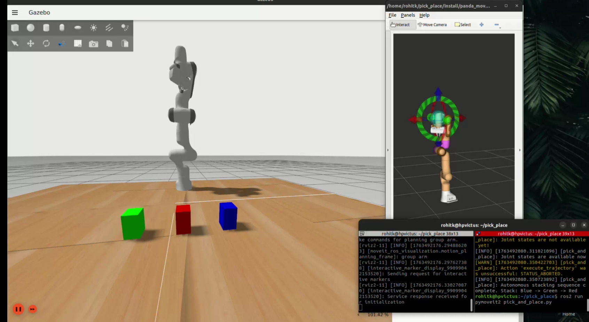

🦾 Franka_Panda_roboticarm_boxes_stacking


🎥 Demonstration

Click the image below to watch the  demo :

[](https://drive.google.com/file/d/11DRNhhwqWrQpcA3NUCiUI5aaxphr7ieS/view?usp=sharing)


## 🧩 Prerequisites

  ROS2 Humble Hawksbill**
  Ignition Fortress 6 & Gazebo
  Ubuntu 22.04
  RViz2
  MoveIt2

⚙️ Build Instructions

Clone this repository into your ROS2 workspace (e.g., ~/pick_place_ws/src):

```bash
mkdir -p ~/pick_place_ws/src
cd ~/pick_place_ws/src
git clone https://github.com/rohitkunnath/boxes_stacking.git
```

Build the workspace:

```bash
cd ~/pick_place_ws
colcon build
```

Source the workspace:
```bash
bash
source install/setup.bash
```

🚀 How to Run the Project

🖥️ Terminal 1 – Launch the Panda Pick-and-Place Simulation

```bash
cd ~/pick_place_ws
ros2 launch panda_bringup pick_and_place.launch.py
```

🧭 Terminal 2 – Run the Pick-and-Place Control Script

  ```bash

cd ~/pick_place_ws
ros2 run pymoveit2 pick_and_place.py
```

🧾 Notes

Make sure to source both the ROS2 installation and your workspace before running any commands:

bash
source /opt/ros/humble/setup.bash
source ~/pick_place_ws/install/setup.bash
